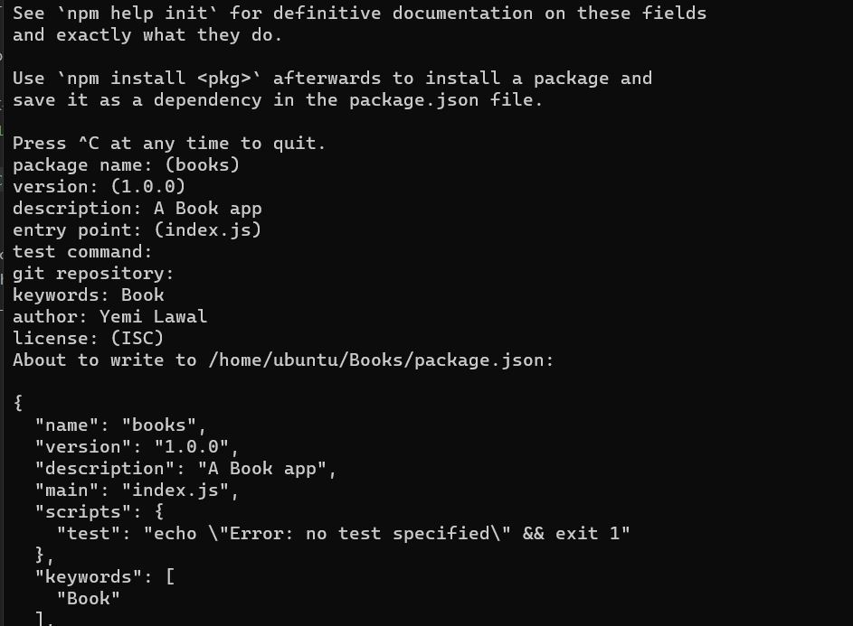
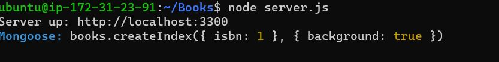
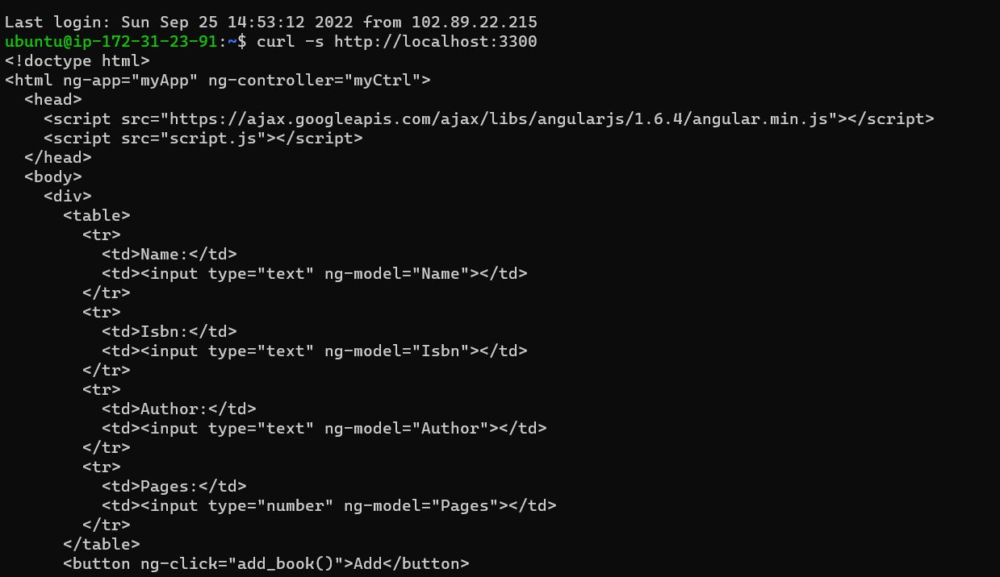
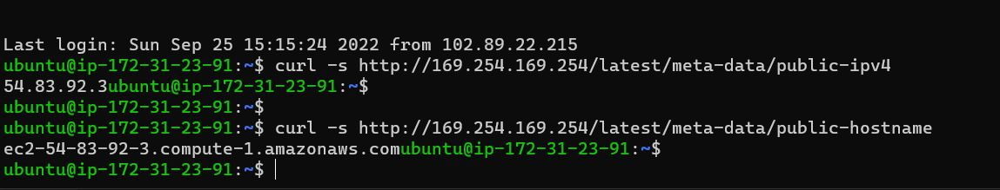
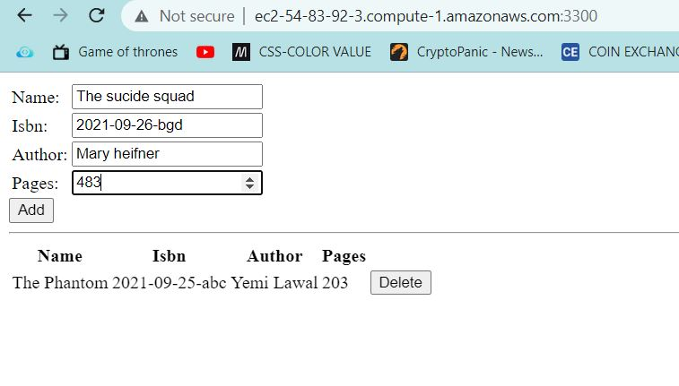

# AWS MEAN STACK IMPLEMENTATION
## **This project shows how to implement MEAN(Mongodb-ExpressJS-AngularJS-NodeJS) on AWS

## .......................................Installing NodeJS......................................

Lets update and upgrade the Ubuntu Server.

`sudo apt update -y` and `sudo apt upgrade -y`

Add certificates.

`sudo apt -y install curl dirmngr apt-transport-https lsb-release ca-certificates`

`curl -sL https://deb.nodesource.com/setup_12.x | sudo -E bash -`

Now let's Install NodeJS

`sudo apt install nodejs -y`

## ..................Installing MongoDB.........................
---

MongoDB stores data in flexible, JSON-like documents. Fields in a database can vary from document to document and data structure can be changed over time. 

create the repository

`sudo apt-key adv --keyserver hkp://keyserver.ubuntu.com:80 --recv 0C49F3730359A14518585931BC711F9BA15703C6`

`echo "deb [ arch=amd64 ] https://repo.mongodb.org/apt/ubuntu trusty/mongodb-org/3.4 multiverse" | sudo tee /etc/apt/sources.list.d/mongodb-org-3.4.list`

Install MongoDB

`Sudo install mongodb -y`

Start Mongodb service

`sudo systemctl start mogodb`

Verify that the service is up and running

`sudo systemctl status mogodb`

Let's also install npm – Node package manager.

`sudo apt install npm -y`

We will install Install body-parser package next to enable the server process json request sent to it.

`sudo npm install body-parser -y`

Now create a folder called boooks in the root directory and enter the directory.

`mkdir Books && cd Books`

run the npm init command to initialize the npm project.

`npm init`

Complete the initialization process using the wizard, this will create a package.json file in the `Books` folder.



Create a file named server.js in the Books folder.

`vi server.js`

copy and paste the below command into the server.js file.

```
var express = require('express');
var bodyParser = require('body-parser');
var app = express();
app.use(express.static(__dirname + '/public'));
app.use(bodyParser.json());
require('./apps/routes')(app);
app.set('port', 3300);
app.listen(app.get('port'), function() {
    console.log('Server up: http://localhost:' + app.get('port'));
});
```

## ............INSTALL EXPRESS AND SET UP ROUTES TO THE SERVER...............
---

Lets install express and setup routes to reach the server.

A quick note on express, Express is a minimal and flexible Node.js web application framework that provides features for web and mobile applications. We will use Express in to pass book information to and from our MongoDB database.

We wil also install the Mongoose package which provides a straight-forward, schema-based solution to model your application data. We will use Mongoose to establish a schema for the database to store data of our book register.

`sudo apt install -y express mongoose`

In ‘Books’ folder, create a folder named apps and enter the folder.

`mkdir apps && cd apps`

In the apps folder create a file calles route.js with the command `vi route.js.`

Copy and paste the below command in the `route.js` file

```
var Book = require('./models/book');
module.exports = function(app) {
  app.get('/book', function(req, res) {
    Book.find({}, function(err, result) {
      if ( err ) throw err;
      res.json(result);
    });
  }); 
  app.post('/book', function(req, res) {
    var book = new Book( {
      name:req.body.name,
      isbn:req.body.isbn,
      author:req.body.author,
      pages:req.body.pages
    });
    book.save(function(err, result) {
      if ( err ) throw err;
      res.json( {
        message:"Successfully added book",
        book:result
      });
    });
  });
  app.delete("/book/:isbn", function(req, res) {
    Book.findOneAndRemove(req.query, function(err, result) {
      if ( err ) throw err;
      res.json( {
        message: "Successfully deleted the book",
        book: result
      });
    });
  });
  var path = require('path');
  app.get('*', function(req, res) {
    res.sendfile(path.join(__dirname + '/public', 'index.html'));
  });
};
```

While in the apps folder create another folder called `models` by typing
`mkdir models` go into the folder and create a file called `book.js` 

`cd models && vi book.js`

Copy and paste the below code into the `books.js` file.

```
var mongoose = require('mongoose');
var dbHost = 'mongodb://localhost:27017/test';
mongoose.connect(dbHost);
mongoose.connection;
mongoose.set('debug', true);
var bookSchema = mongoose.Schema( {
  name: String,
  isbn: {type: String, index: true},
  author: String,
  pages: Number
});
var Book = mongoose.model('Book', bookSchema);
module.exports = mongoose.model('Book', bookSchema);
```

## ................ Access the routes with AngularJS ..............
---

AngularJS provides a web framework for creating dynamic views in your web applications. we will use AngularJS to connect our web page with Express and perform actions on our book register.

Lets go to Books root directory and create folder name public

`cd Books && mkdir public`

create a fil named `script.js` and copy paste the below command into the file.

```
var app = angular.module('myApp', []);
app.controller('myCtrl', function($scope, $http) {
  $http( {
    method: 'GET',
    url: '/book'
  }).then(function successCallback(response) {
    $scope.books = response.data;
  }, function errorCallback(response) {
    console.log('Error: ' + response);
  });
  $scope.del_book = function(book) {
    $http( {
      method: 'DELETE',
      url: '/book/:isbn',
      params: {'isbn': book.isbn}
    }).then(function successCallback(response) {
      console.log(response);
    }, function errorCallback(response) {
      console.log('Error: ' + response);
    });
  };
  $scope.add_book = function() {
    var body = '{ "name": "' + $scope.Name + 
    '", "isbn": "' + $scope.Isbn +
    '", "author": "' + $scope.Author + 
    '", "pages": "' + $scope.Pages + '" }';
    $http({
      method: 'POST',
      url: '/book',
      data: body
    }).then(function successCallback(response) {
      console.log(response);
    }, function errorCallback(response) {
      console.log('Error: ' + response);
    });
  };
});
```
While still in the public directory, create a file called index.html for the app homepage.

`vi index.html`

copy the following code into the file. 

```
<!doctype html>
<html ng-app="myApp" ng-controller="myCtrl">
  <head>
    <script src="https://ajax.googleapis.com/ajax/libs/angularjs/1.6.4/angular.min.js"></script>
    <script src="script.js"></script>
  </head>
  <body>
    <div>
      <table>
        <tr>
          <td>Name:</td>
          <td><input type="text" ng-model="Name"></td>
        </tr>
        <tr>
          <td>Isbn:</td>
          <td><input type="text" ng-model="Isbn"></td>
        </tr>
        <tr>
          <td>Author:</td>
          <td><input type="text" ng-model="Author"></td>
        </tr>
        <tr>
          <td>Pages:</td>
          <td><input type="number" ng-model="Pages"></td>
        </tr>
      </table>
      <button ng-click="add_book()">Add</button>
    </div>
    <hr>
    <div>
      <table>
        <tr>
          <th>Name</th>
          <th>Isbn</th>
          <th>Author</th>
          <th>Pages</th>

        </tr>
        <tr ng-repeat="book in books">
          <td>{{book.name}}</td>
          <td>{{book.isbn}}</td>
          <td>{{book.author}}</td>
          <td>{{book.pages}}</td>

          <td><input type="button" value="Delete" data-ng-click="del_book(book)"></td>
        </tr>
      </table>
    </div>
  </body>
</html>
```

Go back to the Books directory and start the express server.

`cd .. && node server.js`

The server is now up and should be reachable via port 3300.



Lets run a curl on the url to test the connection.

`curl -s http://localhost:3300`

The output should be as shown below.



This prints out the response in html. Lets test using the web browser. First we need to retrieve the ip or the hostname of our server using the aws commands below.

`curl -s http://169.254.169.254/latest/meta-data/public-ipv4`

`curl -s http://169.254.169.254/latest/meta-data/public-hostname`

Running these two commands will bring out the following output.



Open a browser and input the `ip address or hostname` followed by `:3300` which is the port number for our application.

`http://ec2-54-83-92-3.compute-1.amazonaws.com:3300/` replace the hostname with that of you server.




